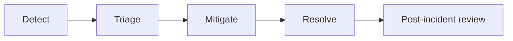

# TradeScore — Incident response playbook

**Purpose:** Respond consistently when monitoring fires (uptime, errors, payments, database) or users report outages.

**Related:** `MONITORING_SETUP.md`, `MONITORING_CHECKLIST.md`, `SUPPORT_PROCEDURES.md`, `EMAIL_SETUP.md` (comms).

---

## 1. Severity levels

| Severity | Definition | Examples | Response target |
|----------|------------|----------|-----------------|
| **SEV-1** | Full outage or data loss risk; payments broadly failing | Site down; Mongo primary unreachable; Stripe webhooks mass-fail | **Immediate** — all hands |
| **SEV-2** | Major degradation | Key flow broken (checkout); error rate **&gt; 5%** sustained | **&lt; 15 min** — eng owner + comms |
| **SEV-3** | Partial / workaround exists | Slow pages; non-critical API errors | **&lt; 4 hours** |
| **SEV-4** | Low impact | Single edge case; cosmetic | Next business day |

Escalate **one level** if security or payment integrity is uncertain.

---

## 2. Roles (adjust titles to your org)

| Role | Responsibility |
|------|----------------|
| **Incident Commander (IC)** | Coordinates response; makes time-boxed decisions |
| **Communications** | User-facing updates (status page, social, email) |
| **Technical lead** | Debug, mitigate, rollback, patch |
| **Scribe** | Timeline, actions, evidence in incident doc |

For small teams, one person may cover IC + tech.

---

## 3. Incident lifecycle



1. **Detect** — alert, user report, or Stripe/Mongo dashboard.  
2. **Triage** — confirm impact, assign severity, open **incident channel** (e.g. Slack `#inc-2026-04-23`).  
3. **Mitigate** — restore service first (rollback, scale, failover, disable feature flag).  
4. **Resolve** — root cause fixed or documented follow-up.  
5. **Post-incident** — blameless review within **5 business days** for SEV-1/2.

---

## 4. First 15 minutes checklist

- [ ] Acknowledge alert (stop paging noise if duplicate)
- [ ] Check **UptimeRobot** / synthetic monitors — false positive?
- [ ] Check **last deployment** time — correlate with start
- [ ] Open **Sentry** — new release? Spike in one issue?
- [ ] Open **Stripe** — payment or webhook anomalies?
- [ ] Open **Atlas** — cluster health, connections
- [ ] Post **internal** summary: status (investigating / identified / mitigating)

---

## 5. Common scenarios & actions

### 5.1 Website down (immediate alert)

| Step | Action |
|------|--------|
| 1 | Verify from external network + mobile; check DNS / SSL expiry |
| 2 | Check host status (Vercel, etc.) |
| 3 | **Rollback** to last good deployment if recent deploy |
| 4 | If DB only broken — `/` might load but `/api/health` fails; see §5.4 |

**Comms:** status page + pinned post if prolonged (&gt; 15 min).

### 5.2 High error rate (&gt; 5%)

| Step | Action |
|------|--------|
| 1 | Sentry: top issue, release regression? |
| 2 | Logs: 5xx from which route? tRPC vs webhook? |
| 3 | Roll back or hotfix; increase sampling temporarily for diagnosis |

### 5.3 Payment failures (&gt; 10%)

| Step | Action |
|------|--------|
| 1 | Stripe Dashboard → failed payments by decline code |
| 2 | Webhook logs — are events failing server-side? |
| 3 | Check API keys (live vs test), webhook secret, idempotency bugs |
| 4 | If provider outage — follow Stripe status: [https://status.stripe.com](https://status.stripe.com) |

**Do not** ask customers for full card numbers in support.

### 5.4 Database connection lost

| Step | Action |
|------|--------|
| 1 | Atlas alerts + cluster metrics |
| 2 | IP allowlist / network change? Credential rotation? |
| 3 | Restart app workers if connection pool stuck (after Atlas healthy) |
| 4 | Scale cluster tier if consistently at limits |

### 5.5 Slow page load (&gt; 5 s)

| Step | Action |
|------|--------|
| 1 | RUM / Sentry performance — which route? |
| 2 | Third-party scripts? Large images? |
| 3 | DB slow queries — Atlas Profiler |
| 4 | Temporary CDN/cache purge if stale bad assets |

### 5.6 High CPU / memory

| Step | Action |
|------|--------|
| 1 | Identify process (Node, Python, container) |
| 2 | Traffic spike vs leak — graph over 24h |
| 3 | Scale horizontally / vertically; restart if stuck |
| 4 | Profile after incident |

---

## 6. Communication templates

### 6.1 Internal (Slack)

```
[SEV-2] TradeScore — Investigating elevated 5xx on checkout
IC: @name | Started: 14:05 UTC | Status: investigating
Impact: users may see errors completing lead payment
Links: Sentry ISSUE-123 | Stripe webhook dashboard
```

### 6.2 External — status page / social (short)

```
We’re aware some users are having trouble completing payments. We’re investigating and will update within 30 minutes. Thanks for your patience — Team TradeScore
```

### 6.3 External — resolution

```
The issue affecting payments is resolved. If you were charged incorrectly, email hello@tradescore.uk with your account email and we’ll help. Thank you.
```

Align wording with **Terms** and **Support** policies.

---

## 7. Incident report template

Save as `incidents/YYYY-MM-DD-short-title.md`.

```markdown
# Incident: [title]
- **Date:** 
- **Severity:** SEV-
- **Duration:** 
- **IC:** 

## Impact
- Users affected (approx):
- Revenue / leads affected (if known):

## Timeline (UTC)
- HH:MM — Detection
- HH:MM — Mitigation
- HH:MM — Resolved

## Root cause


## What went well


## What went wrong


## Action items
| Item | Owner | Due |
|------|-------|-----|
| | | |
```

---

## 8. Tool links (incident time)

| Need | URL |
|------|-----|
| UptimeRobot | [https://uptimerobot.com/dashboard](https://uptimerobot.com/dashboard) |
| Sentry | [https://sentry.io](https://sentry.io) |
| Stripe | [https://dashboard.stripe.com](https://dashboard.stripe.com) |
| Stripe status | [https://status.stripe.com](https://status.stripe.com) |
| MongoDB Atlas | [https://cloud.mongodb.com](https://cloud.mongodb.com) |
| MongoDB status | [https://status.mongodb.com](https://status.mongodb.com) |
| Vercel status | [https://www.vercel-status.com](https://www.vercel-status.com) |

---

## 9. Escalation contacts (fill in)

| Role | Contact | Hours |
|------|---------|-------|
| Primary on-call | | |
| Engineering lead | | |
| Founder / exec | | |
| Stripe account owner | | |
| MongoDB org owner | | |

---

## 10. Aftercare

- [ ] Monitoring thresholds tuned if noisy or silent  
- [ ] Runbook updated (`MONITORING_SETUP.md`, this file)  
- [ ] Customers with open tickets from incident — bulk reply  
- [ ] Legal / ICO only if personal data breach — follow Privacy Policy breach section  

---

*Blameless culture: fix systems, not people. Update contacts and severities as the team grows.*
